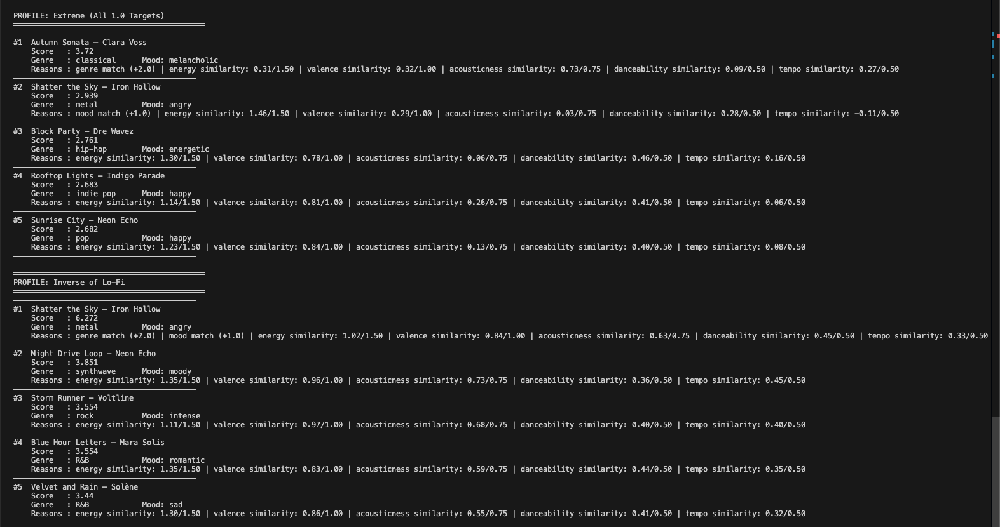
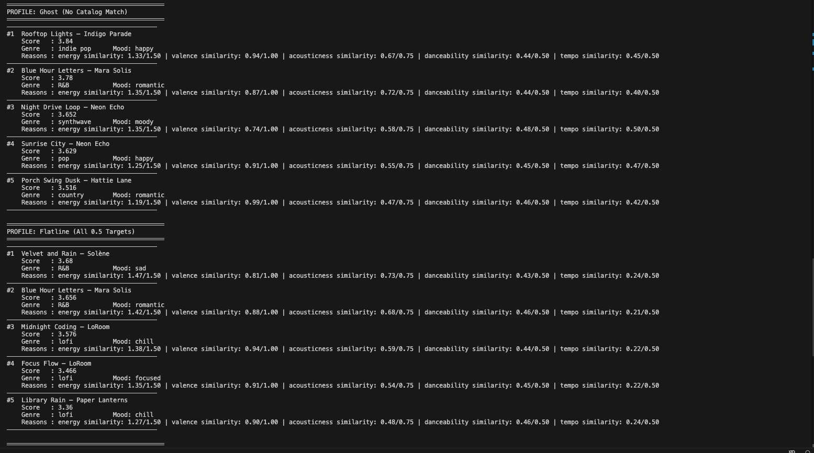
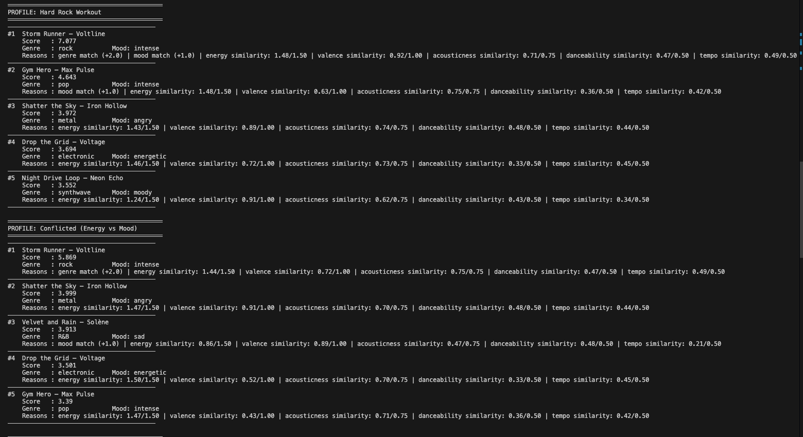
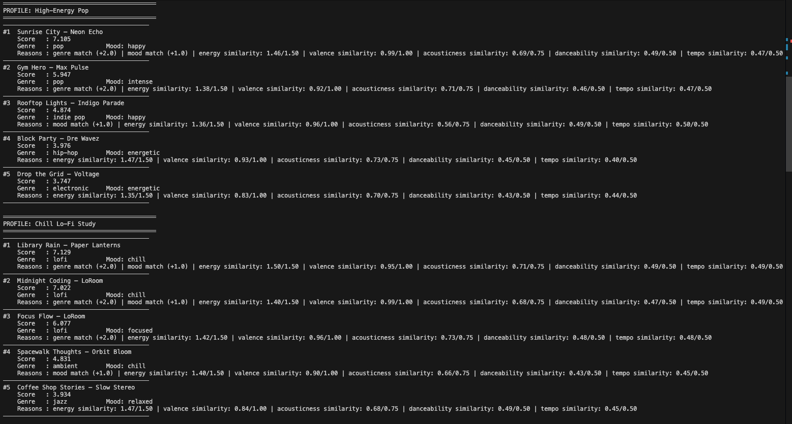

# 🎵 Music Recommender Simulation

## Project Summary

In this project you will build and explain a small music recommender system.

Your goal is to:

- Represent songs and a user "taste profile" as data
- Design a scoring rule that turns that data into recommendations
- Evaluate what your system gets right and wrong
- Reflect on how this mirrors real world AI recommenders

Replace this paragraph with your own summary of what your version does.

---

## How The System Works

Unlike collaborative filtering, where apps like Spotify compare your listening habits to millions of other users, this project uses **content-based filtering**, which scores songs entirely based on the actual vibe of the music itself. It builds your custom taste profile and scores every song based on how well its tempo, energy, mood, and genre match exactly what you're looking for. The highest-scoring tracks then become your personal recommendations. Just keep in mind that genre carries the most weight, meaning a perfect-sounding track in the wrong genre might still lose out to an average song in your preferred category.

**What Real Systems Track:**
- Explicit signals: likes, skips, star ratings, purchase history, search queries
- Implicit signals: play counts, listen duration, repeat plays, scroll-past behaviour, time-of-day patterns

---

## Algorithm Recipe

The system starts with a personal taste profile, a small snapshot of your preferences that captures your favorite genre and mood, plus how energetic, emotionally uplifting, fast, danceable, and acoustic you like your music to be. For every song in the catalog, it calculates a score by awarding points when the genre and mood match your preferences, then adding further points based on how closely each song's energy, emotional brightness, tempo, danceability, and acoustic character line up with your targets, the closer the match on each quality, the more points it earns. Once every song has a score, the list is sorted from highest to lowest and the top few songs rise to the surface as your personalized recommendations. One honest caveat: genre carries the single largest fixed point value of any feature, so a song that perfectly matches your mood and energy but belongs to the wrong genre will always rank below a song that shares your genre but misses on everything else — meaning the system can feel like it over-rewards genre loyalty at the expense of how a song actually sounds.

---

## Features Used In This Simulation

| Object | Fields |
|---|---|
| Song | id, title, artist, genre, mood, energy, tempo_bpm, valence, danceability, acousticness |
| UserProfile | favorite_genre, favorite_mood, target_energy, target_tempo_bpm, target_valence, target_danceability, target_acousticness |

---

## Stress Test Results

The following screenshots show the top 5 recommendations produced by each
test profile, including three standard profiles and five adversarial edge cases.

### High-Energy Pop & Chill Lo-Fi Study

*High-Energy Pop correctly surfaces Sunrise City (7.105) with full genre and mood
match. Chill Lo-Fi Study locks onto lofi catalog entries with scores above 7.0.*

### Hard Rock Workout & Conflicted (Energy vs Mood)

*Hard Rock Workout ranks Storm Runner #1 with a 7.077 score. The Conflicted
profile reveals that high energy overrides mood mismatch — sad songs still rank
in the top 5 when their audio features align.*

### Ghost (No Catalog Match) & Flatline (All 0.5 Targets)

*The Ghost profile degrades gracefully, ranking by pure similarity with no genre
or mood bonus. Flatline produces a compressed score range (3.36–3.68), confirming
the ranker still separates songs even with neutral targets.*

### Extreme (All 1.0 Targets) & Inverse of Lo-Fi

*Extreme targets expose that Autumn Sonata tops the chart despite being classical,
driven entirely by acousticness similarity. Inverse of Lo-Fi correctly buries
low-energy songs and surfaces Iron Hollow at #1 with a 6.272 score.*

---


## Getting Started

### Setup

1. Create a virtual environment (optional but recommended):

   ```bash
   python -m venv .venv
   source .venv/bin/activate      # Mac or Linux
   .venv\Scripts\activate         # Windows

2. Install dependencies

```bash
pip install -r requirements.txt
```

3. Run the app:

```bash
python -m src.main
```

### Running Tests

Run the starter tests with:

```bash
pytest
```

You can add more tests in `tests/test_recommender.py`.

---

## Experiments You Tried

Testing showed that by lowering the massive genre bonus and giving more weight to audio traits, a great-sounding track could finally beat out a mediocre genre match. Additionally, measuring subtle details like the emotional brightness of a song helped break ties and produce much more accurate rankings. Overall, the system proved it can beautifully handle opposite extremes, correctly rewarding tracks that sit closest to your specific targets whether you want an intense rock anthem or a quiet lo-fi beat.
---

## Limitations and Risks

The system struggles because our tiny 18-song catalog lacks variety, forcing it to guess based on random numeric similarities if you ask for an unlisted genre or vibe. Furthermore, since it only reads raw audio data rather than lyrics, it can easily mistake an upbeat-sounding but lyrically depressing track for a happy song. Ultimately, the biggest flaw remains the overwhelming genre bonus, which artificially forces mediocre genre matches to the top while burying genuinely great audio matches from other styles.

---

## Reflection

Read and complete `model_card.md`:

[**Model Card**](model_card.md)

The system ranks songs by awarding points for matching your preferred genre, mood, and specific audio targets. However, the massive point bonus for genre creates a serious flaw, where an intense rock song can easily beat a genuinely sad track just because it fits the requested category. On a larger scale, this traps users in an endless feedback loop that only ever recommends songs within their usual genre box, completely ignoring the actual vibe they are looking for.

---

## 7. `model_card_template.md`

Combines reflection and model card framing from the Module 3 guidance. :contentReference[oaicite:2]{index=2}  

```markdown
# 🎧 Model Card - Music Recommender Simulation

## 1. Model Name

**VibeMatch 1.0**

---

## 2. Intended Use

Simply enter your favorite genre, mood, and preferred vibe, and the system will score every song to find your top five closest matches. It even breaks down the results with specific scores and reasons, giving you total transparency into exactly why each track was recommended for you.

### Non-Intended Use

This system is not built for real-world music apps or massive catalogs that need to process unpredictable user data at scale.

---

## 3. How the Model Works

To find your perfect track, the system scores each song based on how well it matches your tastes. Nailing your preferred genre gives the biggest point boost, and hitting the right mood also adds a flat bonus. Meanwhile, features like energy and tempo earn more points the closer they get to your exact vibe, without any harsh cutoffs.
---

## 4. Data

Our catalog features 18 songs categorized by genre, mood, and five specific audio traits (energy, tempo_bpm, valence, danceability, acousticness), though an uneven mix gives lo-fi tracks an unfair scoring advantage. Since the system relies purely on a hand-written taste profile rather than real listening data, it can't naturally learn or adapt to your evolving music habits over time.
---

## 5. Strengths

This project is perfect for classrooms, prototypes, or anyone curious about how score-based recommenders actually work under the hood. Its transparent logic and simple CSV setup make it incredibly easy to trace and learn from.
---

## 6. Limitations and Bias

The system's massive genre bonus can completely skew your results, like prioritizing an angry rock track over a genuinely sad song or pushing a quiet classical piece to the top of a high-energy profile. Furthermore, if the system can't find any solid matches, it won't just admit defeat. Instead, it confidently spits out an essentially random, closely tied list of tracks as if they were perfect recommendations.

---

## 7. Evaluation

We tested a mix of standard and extreme profiles — including High-Energy Pop, Chill Lo-Fi Study, and Hard Rock Workout — to uncover weak spots in the system's scoring logic. The weirdest outcome was Autumn Sonata taking the top spot on a profile with totally maxed-out targets. This perfectly highlights the system's biggest quirk: the massive genre bonus can easily overpower a terrible audio match, resulting in recommendations that just feel wrong.
---

## 8. Future Work

To fix the system's flaws, we should swap the rigid genre bonus for a sliding scale, allowing tracks with similar styles to compete fairly. We also need to add a warning when a requested vibe isn't in the catalog, along with a minimum score requirement so the system stops spitting out weak, random recommendations when no true match exists.

---

## 9. Personal Reflection

My biggest learning moment was seeing exactly how a score-based recommender works under the hood, and realizing that a massive, rigid genre bonus can easily overpower a terrible audio match. While AI tools are great for drafting these kinds of prototypes, I had to strictly double-check the scoring logic when extreme profiles confidently spit out completely wrong tracks, like a slow classical piece for maxed-out energy targets. It was surprising to see how a simple math equation calculating the closeness of audio traits can genuinely "feel" like a personalized recommendation, flawlessly flipping results between high-energy pop and chill lo-fi profiles. If I extended this project, I would replace the fixed genre bonus with a flexible sliding scale, establish a minimum score floor to stop the system from randomly guessing, and add user warnings when their requested vibe isn't actually in the catalog.

